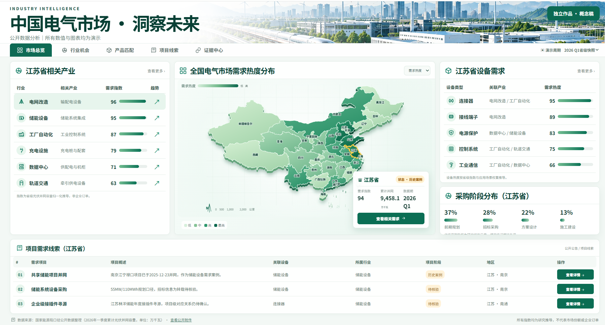

# Electrical Market Research for Phoenix

## 项目目的

这是一个面向菲尼克斯（Phoenix Contact）产品研究的电气市场洞察演示系统。项目通过公开市场调研，把政策导向、产业规划、经济计划、项目公告和行业变化等外部信号整理成可追溯的需求判断，用来预测不同区域和行业的电气设备市场机会。

系统的核心目标是把“市场出现了什么需求”进一步连接到“公司可以匹配什么产品方案”：

- 从政策、产业计划和公开项目中识别潜在市场需求；
- 按行业场景匹配公司的连接器、端子、电源保护、控制系统和工业通信等产品族；
- 对比自家方案与替代方案，分析适用场景、接口条件、维护成本和仍需验证的参数；
- 将已验证的成功案例沉淀进系统，作为后续区域判断、产品匹配和客户沟通的参考。

## 当前演示

首页展示全国省级需求热度地图。点击省份后，相关产业、设备需求、采购阶段和项目线索会同步更新。当前页面以江苏省及南京江宁禄口储能项目作为首批案例，并保留项目事实、来源、历史案例标识和待核验状态。



## 产品匹配逻辑

市场需求预测由公开信号推导，不直接等同于企业订单。系统先识别行业和项目场景，再把需求映射到产品族，随后对自家方案和替代方案进行条件比较。缺少工况、接口、认证、采购主体或项目阶段等信息时，页面会标记为“待核验”或“待补采”，不会直接输出型号结论。

成功案例会按照事实、推断和待验证问题分层记录。案例中的采购角色、设备清单、技术条件和最终供货关系经过补证后，才能作为后续分析的更强依据。

## 数据边界

本项目所有数据、指标、热度、采购阶段和图表均为研究演示内容，并非菲尼克斯或其他企业的真实订单、销售额、客户名单、市场份额或内部经营数据。公开数据只用于展示研究方法和交互流程，不能替代正式的市场预测、商务判断或产品选型。

## 启动与构建

项目由原生 ES Module、HTML、CSS、本地 D3 地理包和省级 GeoJSON 驱动，可离线运行：

```bash
npm run dev
# 浏览器打开 http://localhost:4173

npm run build
npm run verify
```

主要页面：

- **市场总览**：D3 省级热度地图、产业需求、设备需求、采购阶段和项目线索；
- **项目雷达**：项目与采购事件筛选、搜索和状态区分；
- **禄口项目详情**：事实、采购角色、产品方向和待核验清单；
- **产品关联**：自家产品族、替代方案和参数缺口分析；
- **证据中心**：来源、发布日期、读取状态、摘要和原文链接。

项目定位是一个可交互的市场研究原型，用来演示从市场信号到产品匹配、案例沉淀和后续分析的完整链路。
